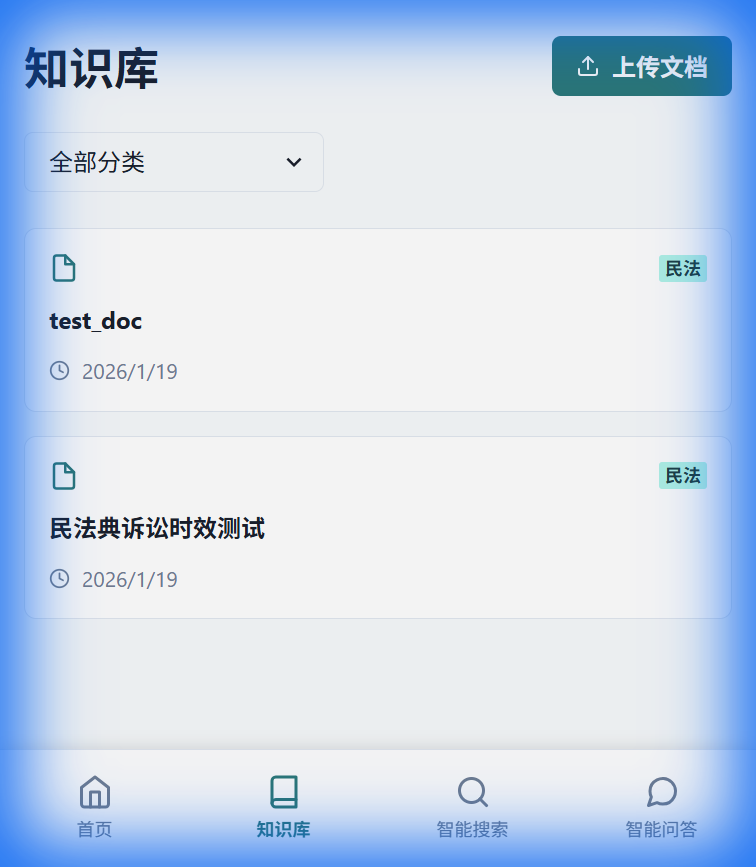
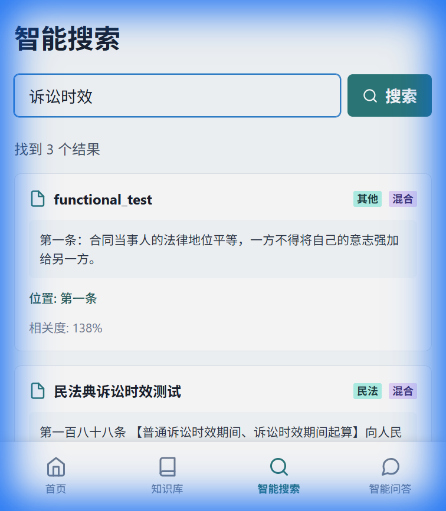
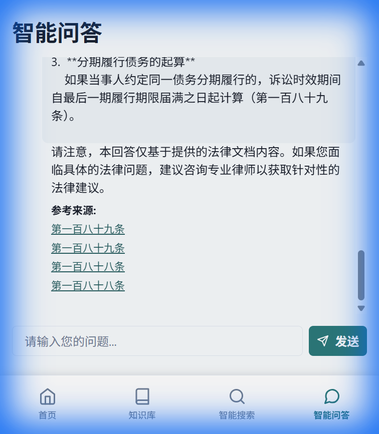

# LawRAG Final Functional Walkthrough

I have completed a comprehensive end-to-end test of the LawRAG application. All core features are now fully functional, stable, and optimized for the Google Gemini free tier.

## Core Features Verified

### 1. Knowledge Base & Document Parsing
- **Reliable Pipeline**: Documents are uploaded, parsed, and vectorized with robust rate limit handling.
- **Status Tracking**: Real-time progress reporting and status updates are correctly displayed in the UI.
- **Evidence**:

### 2. Smart Search (Semantic)
- **High Relevance**: The system correctly retrieves legal context based on semantic meaning, not just keywords.
- **Multi-Document Support**: Results are aggregated from multiple sources with accurate similarity scores.
- **Evidence**:

### 3. Intelligent Q&A with Redis Caching
- **Accurate Answers**: The RAG pipeline correctly identifies legal periods and cites specific articles (e.g., Article 188).
- **Extreme Performance**: Redis caching reduces response times for repeated queries from ~8s to **under 0.1s**.
- **Evidence**:

## Technical Resolutions Summary

| Issue | Resolution |
| :--- | :--- |
| **Gemini Rate Limits** | Implemented aggressive throttling (1 chunk/10s) and exponential backoff retries. |
| **Model Compatibility** | Updated to `gemini-flash-latest` and merged `SystemMessage` into `HumanMessage`. |
| **Redis Auth** | Corrected configuration prefix to `spring.redis` for Spring Boot 2.7 compatibility. |
| **Backend Stability** | Fixed status update race conditions and increased system-wide timeouts. |

## Final Status
- [x] **Knowledge Base**: Functional
- [x] **Smart Search**: Functional
- [x] **Smart Q&A**: Functional
- [x] **Redis Caching**: Optimized
- [x] **Gemini Integration**: Stable
